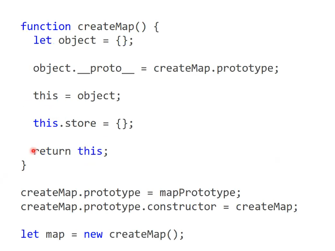

#### `Creator` и `Visit` яркий пример OOP принципа композиции когда методы реализации находиться в одном месте, а данные в другом.

#### Сеттеры и Геттеры через цикл не копируются как методы по ссылке, только так:
```JS
function copy(source, target) {
  return Object.defineProperties(target, Object.getOwnPropertyDescriptors(source));
}
```

#### `__proto__` - это свойство, которое появляется, при создании объекта и указывает на прототип - обьект, который является основой для создания всех объектов у которого есть свойство конструктор значением которого является фу-я Object()

### Есть фу-я Object, которая использует прототип для создания обьектов

### Ключевое слово `new` делает 4 вещи:
  1. Ключевое слово `new` создает новый объект.
  2. Соединяет новосозданный обьект с прототипом.
  3. Привязывает `this` внутри фу-и к самому обьекту.
  4. Возращает объект из фу-и.



### Классическа система наследования
```JS
function Doctor(nameDoctor, experienceDoctor) {
  let name = nameDoctor;
  let experience = experienceDoctor;

  Object.defineProperties(this, {
    'name': {
      get: function() { return name },
      enumerable: true
    },
    'experience': {
      get: function() { return experience },
      enumerable: true
    } 
  });

  this.setName = function(newName) {
    name = newName;
  }

  this.setExpririance = function(newExpiriance) {
    experience = newExpiriance;
  }
}

function Сardiologist(name, experience, pressure, indexOfMass, diseases) {
  Doctor.call(this, name, experience);   //вызываем родительский конструктор
  this.pressure = pressure;
  this.indexOfMass = indexOfMass;
  this.diseases = diseases;
}

Сardiologist.prototype = Object.create(Doctor.prototype); //делаем цепочку прототипов
Сardiologist.prototype.constructor = Сardiologist;   
```
